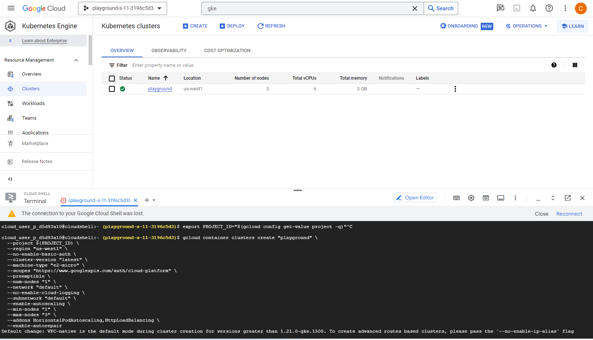
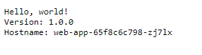

# Learning Google Kubernetes Engine


- [Overview](#overview)
- [Hands On!](#hands-on)
  - [Getting Started with GCP](#getting-started-with-gcp)
    - [Logging on](#logging-on)
    - [Starting a free trial](#starting-a-free-trial)
    - [Select your project](#select-your-project)
  - [Google Kubernetes Engine](#google-kubernetes-engine)
  - [Start the Google Cloud Shell](#start-the-google-cloud-shell)
  - [Create your GKE Cluster](#create-your-gke-cluster)
    - [Command](#command)
    - [Details](#details)
  - [Deploy a web application from a container image](#deploy-hello-app-web-application)
  - [Expose the deployment using an external load balancer Service](#expose-the-deployment)
  - [Scale the deployment for Redundancy](#scale-the-deployment)
  - [Rolling Update: Deploying new application version](#deploying-new-app-version)
  - [Rollback: Roll back to a previous Stable deployment version](#rollback-to-previous-app-version)
  - [Cleanup](#cleanup)


# Overview
In this document, we are going to create a Kubernetes cluster on Google Cloud, using preemptible instances. 
This document provides an overview and step-by-step instructions for getting started with Google Cloud Platform (GCP) 
and Google Kubernetes Engine (GKE). 
You'll learn how to log in, start a free trial, select your project, and use the Google Cloud Shell. 
Additionally, it covers creating a GKE cluster, deploying a web application, exposing it using an external load balancer 
service, and scaling the deployment for redundancy. 
You'll also discover how to perform rolling updates to deploy a new application version and rollback to a previous stable 
deployment version when needed. 
Finally, the document includes cleanup instructions to help you manage your GCP resources efficiently.


# Hands On!

## Getting Started with GCP

### Logging on
https://console.cloud.google.com/

### Starting a free trial
Start the free trial


You will then need to fill your details.
Once everything is complete, you will be taken to this screen.


### Select your project

Select your project at the top, you will see a screen similar to this one.


## Google Kubernetes Engine
Navigate to Kubernetes engine, using the hamburger menu on the left hand side.


## Start the Google Cloud Shell
Google Cloud Shell is an interactive shell environment for Google Cloud Platform. It makes it easy for you to manage your projects and resources without having to install the Google Cloud SDK and other tools on your system. With Cloud Shell, the Cloud SDK gcloud command-line tool and other utilities you need are always available when you need them.

Cloud Shell provides the following:
* A temporary Compute Engine virtual machine instance
* Command-line access to the instance from a web browser
* Built-in code editor BETA
* 5 GB of persistent disk storage
* Pre-installed Google Cloud SDK and other tools
* Language support for Java, Go, Python, Node.js, PHP, Ruby and .NET
* Web preview functionality
* Built-in authorization for access to GCP Console projects and resources


## Create your GKE Cluster

If you just created your new account, it will take 5-10 minutes before you're able to create a new cluster.

### Command

```
export PROJECT_ID="$(gcloud config get-value project -q)"

gcloud container clusters create "playground"   --project ${PROJECT_ID}   --region "us-west1"   --machine-type "e2-micro"   --preemptible   --num-nodes "3"   --network "default"   --min-nodes "1"   --max-nodes "3"   --addons HorizontalPodAutoscaling,HttpLoadBalancing   --enable-autorepair

gcloud container clusters get-credentials playground --zone us-east1-b --project ${PROJECT_ID}
```


This command will take roughly 5 minutes to complete.
Remember, if you open a new Cloud Shell, you will need to run the `export PROJECT_ID="$(gcloud config get-value project -q)"` command again.





In the meantime, in the menu, open Monitoring, under Stackdriver, and enable it for your account if it wasn't done already. This will allow it to monitor your cluster in the background.

### Details

* `gcloud container clusters create "playground"`: creates a Google Kubernetes Engine (GKE) cluster named "playground" with provided settings
* `--project ${PROJECT_ID}`: We specify which project to create the cluster into
* `--region "us-west1"`: Region in which the cluster will be created
* `--machine-type "e2-micro"`: Sets the machine type for the cluster nodes to "e2-micro," which is a small, cost-effective machine type.
* `--preemptible`: User preemptible VMs, which Google can terminate if it requires more compute. [See more...](https://cloud.google.com/preemptible-vms/)
* `--num-nodes "3"`: Require 3 VMs for the cluster
* `--min-nodes "1" --max-nodes "3"`: The cluster can scale between 1 and 3 nodes
* `--addons HorizontalPodAutoscaling,HttpLoadBalancing`: Required to allow the cluster to scale the pods and use the Google Cloud Load Balance.
* `--enable-autorepair`: Let GKE repair unhealthy nodes


## Deploy hello-app web application

`kubectl create deployment web-app --image us-docker.pkg.dev/google-samples/containers/gke/hello-app:1.0`

We executed this command to create a Kubernetes deployment named "web-app." A deployment manages a set of identical pods, ensuring that the desired number of instances of your application is running. In this case, it's using a Docker image from the specified container registry (us-docker.pkg.dev) and the image name "hello-app" with version "1.0." This deployment is the foundation for running your application on Google Kubernetes Engine (GKE).


`kubectl get deploy`

Run this command to see the newly created Deployment running in your Kubernetes cluster. A deployment manages the desired state of your application by controlling replica sets and pods. By running this command, you can see the status and details of your deployments, including the number of desired and available replicas.


`kubectl get pods -o wide`

Run this command to see the newly created pod(s) of the "web-app" depliyment running in your Kubernetes cluster, along with additional details in wide output format. Pods are the smallest deployable units in Kubernetes, representing a single instance of a running process. The wide output format provides additional information such as the node on which each pod is scheduled, which can be helpful for troubleshooting and debugging.


## Expose the deployment
The application is running, however we cannot access it externally yet, we need to expose it.

`kubectl expose deployment web-app --port=80 --target-port=8080 --type=LoadBalancer`

Run this command to exposes "web-app" deployment to the internet using a LoadBalancer service. It ensures that the application within the deployment can be accessed on port 80. The --port option specifies the port on which the service will listen within the cluster (port 80 in this case), and the --target-port option specifies the port on which the application in the pods is running (port 8080 in this case). This setup allows external traffic to reach your application, making it accessible from outside the cluster.

The service "web-app" will be now created when you run the above "kubectl expose" command. This command creates a Kubernetes service with the name "web-app" and exposes it externally as a LoadBalancer type service, which triggers the provisioning of a LoadBalancer resource in your Kubernetes cluster. The LoadBalancer resource is responsible for managing the external IP address and routing traffic to the pods associated with the "web-app" deployment, ensuring external access to your application on port 80.

`kubectl get svc web-app --watch`

This command watches and displays information about the Kubernetes service named "web-app" in real-time. A service is an abstraction that defines a set of pods and how to access them. Using the --watch flag means that it will continuously update and show the service's status in real-time, including its external IP address once it has been assigned by the cloud provider's LoadBalancer service, allowing you to monitor its status and accessibility as it becomes available..

`curl <EXTERNAL-IP>`

This command uses the curl utility to make an HTTP request to the external IP address (replace <EXTERNAL-IP> with the actual external IP address of your "web-app" service). In the context of a LoadBalancer service created with kubectl expose, this allows you to access your application externally over the internet. You would typically use this command to test and verify that your application is reachable and functioning as expected.

We can alternatively copy the External IP and access it in a browser tab.

Here you go, your app is working!




## Scale the deployment

`kubectl scale deployment web-app --replicas 3`

Run this command to scale the Kubernetes deployment named "web-app" to have 3 replicas, meaning it will create and manage three instances of your application pods. Scaling your deployment in this way allows you to increase the availability and capacity of your application as needed to handle more traffic or workload.

`kubectl get pods --watch`

It watches and displays information about the pods running in your Kubernetes cluster in real-time. By using the --watch flag, it continuously updates and shows the status of the pods. When you scale your deployment with the previous command, this command will reflect the changes by showing the creation and status updates of the new pods as they are added to the cluster. 


## Deploying new application version using Rolling update

`kubectl set image deployment web-app hello-app=us-docker.pkg.dev/google-samples/containers/gke/hello-app:2.0`

When we want to Upgrade the version of "hello-app" application, this command changes the image for the container named "hello-app" to version "2.0." This allows you to roll out a new version of your application by simply updating the container image, making it easy to manage and deploy updates to your application.

`kubectl get pods --watch`


Alternatively, we can run the following command:

`kubectl edit deploy web-app`

This command opens the configuration for a Kubernetes deployment named "web-app" in your default text editor. You can modify the deployment's configuration interactively, including properties like the number of replicas, container images details and version, and other settings. Once you've made your changes and saved the file, Kubernetes will automatically apply the updates to the deployment, ensuring that your changes take effect. This is a convenient way to make on-the-fly adjustments to your application's deployment configuration.

We can make both the relica & image level changes as follows:


## Roll back to a previous Stable deployment Version

The "kubectl rollout" command displays the rollout history of our "web-app" Kubernetes deployment. The rollout history provides information about the revisions and changes made to the deployment over time, including when each revision was created and what changes were applied. It's useful for tracking the deployment's history and understanding the sequence of updates.

`kubectl rollout history deployment/web-app`


As shown above "Revision 1" is previous Stable version (v1) & "Revision 2" is the current one. If we want to rollback to "Revision 1" (due to compatibility, performance, deployment issues etc), we will run the following command,

`kubectl rollout undo deployment/web-app --to-revision=1`

This command allows you to undo a deployment update and roll back to a specific revision. In this example, it rolls back the "web-app" deployment to revision 1. This can be helpful when you need to revert to a previous version of your application due to issues or errors introduced in a recent update. The --to-revision flag specifies the revision number to which you want to roll back.


## Cleanup
Delete the Deployment and Service

`kubectl delete services,deployment web-app`

This command deletes both the Kubernetes service and deployment named "web-app" in one go. The kubectl delete command is used to remove resources, and by specifying both "services" and "deployment," it ensures that both the service and the deployment associated with the "web-app" application are deleted. This is a convenient way to clean up resources when you no longer need them, ensuring that both the service and deployment are removed from your cluster.

Delete the playground cluster

`gcloud container clusters delete playground --zone us-west1`

It will delete our "playground" GKE Cluster located in the "us-west1" zone. It instructs Google Cloud to remove all the resources associated with the cluster, including nodes, pods, and services. Please use this command to completely delete your GKE cluster to stop incurring charges in Google Cloud after completion of your lab.


